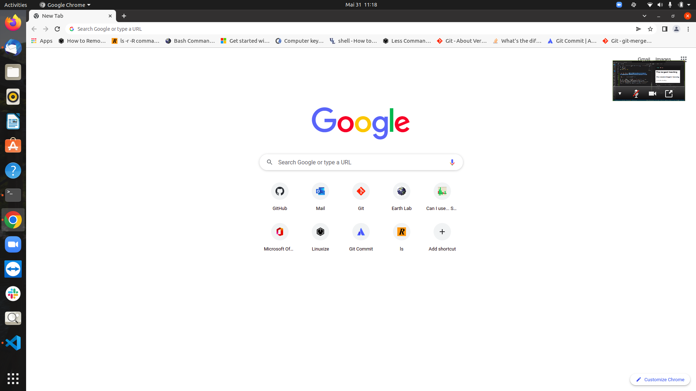

# Markdown (Repo Title Recommended)
# h1
## h2
### h3
#### h4
##### h5
###### h6

This is just **normal** text

use * * to make Text Bold.

This is normal _Text_.

Use _ to make Italic.

This is normal ~~Text~~.

~~This is normal Text~~

~ strike

> This is a quote block-

>> This is extra quote block.

To update software in linux,use the following Commands:

Normal Code Formatting
```
sudo apt update
sudo apt upgrade -y
```
For Terminal
```sudo apt update```




For more info,visit [Github Docs](https://docs.github.com/en/get-started/writing-on-github/getting-started-with-writing-and-formatting-on-github/basic-writing-and-formatting-syntax) website.